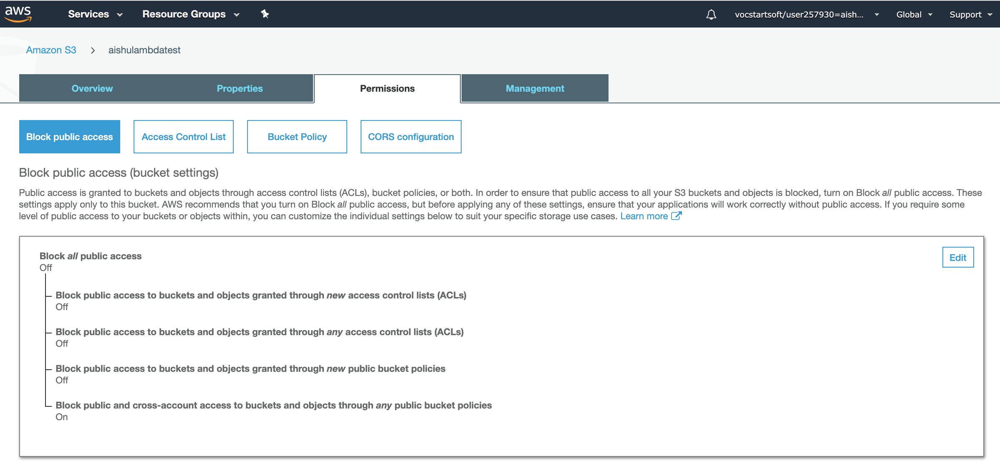
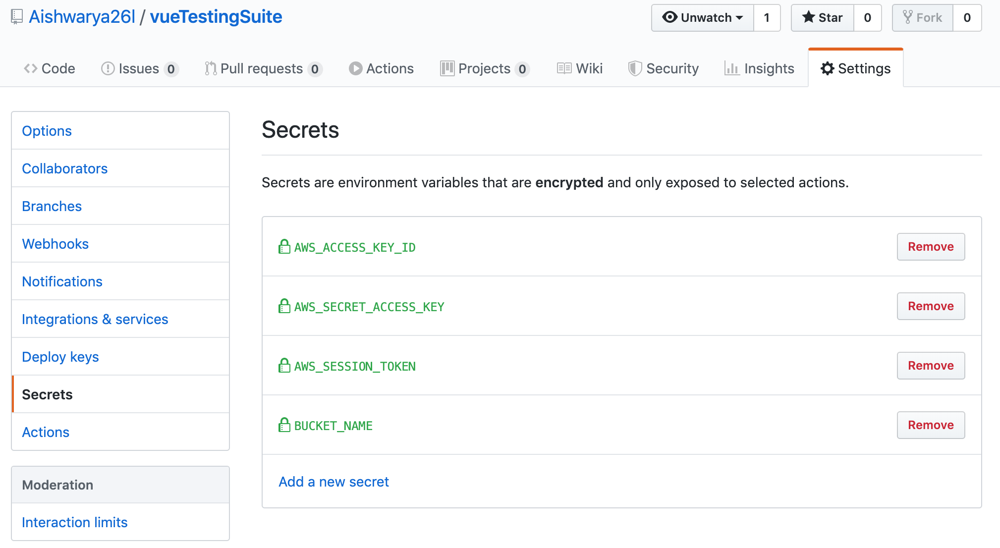
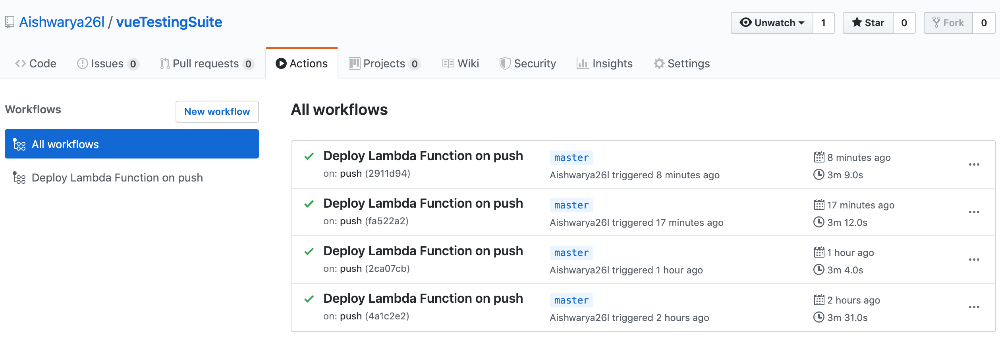
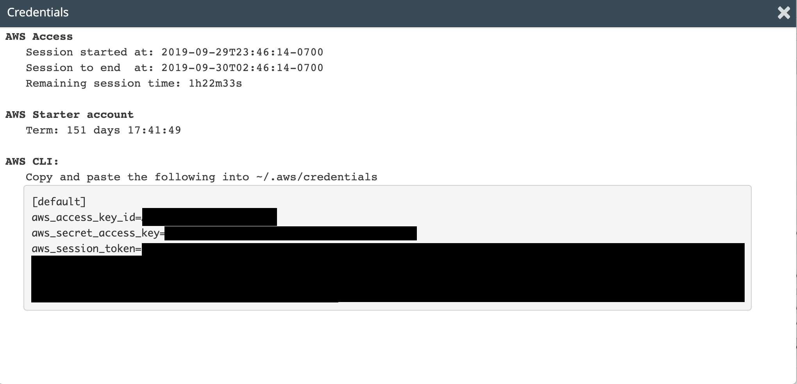

# Vue Testing Suite

Vue Testing Suite enables a user to create an AWS Lambda function with Vue testing abilities. 

***

## AWS Lambda Function
**AWS Lambda Function Configuration details -** 

| -                 | Value                       |
| ------------------|:---------------------------:|
| **Function name** | vueTestingSuite             |
| **Runtime**       | Node.js 10.x                |
| **Execution role**| lambda_basic_execution role |
| **Memory (MB)**   | 1024 MB                     |
| **Timeout**       | 40 sec                      |
| **Trigger**       | API Gateway                 |

*** 

## Deployment
This repository supports auto-deployment of the lambda function on every push to this project using GitHub Actions.
### Prerequisite -
1. Create an AWS S3 bucket with permissions to access objects publically.

   Here's an example S3 bucket with the required permissions -
   
   
### Steps to deploy -
1. Fork the repository and clone the contents
   ```bash
   git clone https://github.com/<your-username>/vueTestingSuite
   ```
2. Navigate to Repository settings on the GitHub console > Click on secrets
3. Add the following secret key value pairs - 
   ```python
   AWS_ACCESS_KEY_ID = # AWS users credential details
   AWS_SECRET_ACCESS_KEY = # AWS users credential details
   AWS_SESSION_TOKEN = # AWS Educate users credential details
   BUCKET_NAME = # S3 Bucket name where objects can be publically accessible
   ```
   
   The following Github secrets must be created -
   
   
4. Make changes to your Lambda function code in the src directory. Commit and push
   ```bash
   git add .
   git commit -m "Update changes"
   git push
   ```
3. On push, GitHub Action is trigerred and the status of the deployments can be viewed under the actions tab.
   

***

**Note:** 
For AWS Educate Users, users credentials expire and will have to be overwritten in the project secrets settings on github in case of expiry before an update.

AWS Educate user credentials - 

